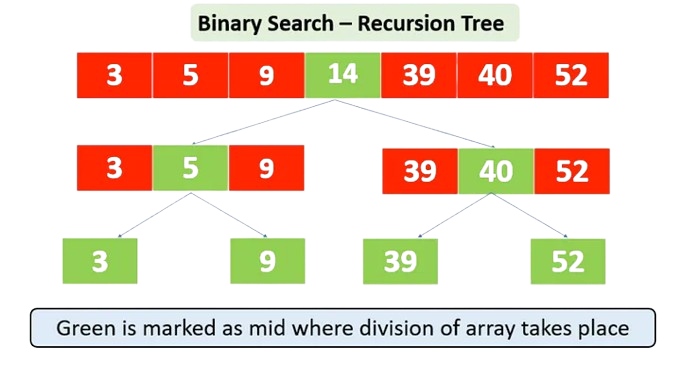

# Chapter 01: Introduction to Algorithms

The first chapter of Grokking Algorithms introduces the programmer to the concept of algorithms and demonstrates how they can expedite results simply by altering the underlying logic. Furthermore, this chapter delves into algorithm performance, discussing methods for comparison using big O notation and logarithmic time complexity to ascertain their efficiency.

## Binary Search

The primary algorithm showcased is the binary search. The book initially make readers familiar with the search problem, using a phone book as an illustrative example. The task entails locating the number of a person whose name begins with 'K'.

To solve this, two methods were shown:

- **Linear search**: A name by name search, from the start until the end. If the book ended in K, this would involve searching through the entire phone book. How long would this take in a thousand page book?

- **Binary search**: A search starting in the middle. Because K is known to be closer to the middle, this approach eliminates all possibilities between the beginning and middle of the book, speeding up the search, as we don't have to search for names that certainly don't start with K.

Of course, the most logic option is the second one.

The essence of a binary search lies in efficiently narrowing down possibilities with each operation. This is achieved by comparing the search value with two positions within a sorted list.

If the search value is closer to the end of the list, we eliminate all values from the start to the middle and proceed to search from the middle to the end. Conversely, if it's closer to the beginning, we search from the start to the middle and eliminate all values from the middle to the end.

_Binary Search - Recursion Tree by [Anshu &ndash; Medium](https://medium.com/@imanshu822/binary-search-and-its-powerful-applications-39ae7d7bca69)_

However, for this algorithm to function effectively, the list must be sorted in some manner. This is precisely why the phone book serves as a fitting example &ndash; it's typically sorted alphabetically.

## Algorithm Performance

Algorithm performance is all about time complexity. Time complexity is all about how many steps your algorithm does to yield a result. The fewer operations are taken, the less time it will take to reach a result. Furthermore, this chapter explains that time complexity is expressed with logarithms and big O notation.

To explain each concept and solidify how the binary search works, the book introduces a new problem: the number guessing game. In this game, a number between 1 and 100 must be guessed. With each guess, the player receives feedback indicating whether the guess is too high, too low, or correct.

Once again, two approaches can be employed to find the correct number. If a linear search is used, up to 100 guesses may be required. However, employing binary search, which systematically halves the possibilities with each guess, requires a maximum of 7 guesses to find the correct number.

This exemplifies precisely what the book denotes by algorithm performance: achieving the same result with fewer operations. Fewer operations results in shorter running times. This even more notable for bigger problems: guess between 1 and 240.000. Linear search can take up to 240.000 guesses in worst case. Binary search take at most 18!

## Logarithmic time

When talking about how many operations an algorithms does to yield a result, there's a relation between logarithm and the steps amount. Generally, perfomatic algorithms run in logarithm time. This means that for a list of size `n`, it will take up to `log n` steps to reach a result. When talking about perfomance, the logarithmic base is always `2`.

Using the guessing game again, for 240.000 possibilites, we have:

- **Linear Search**: takes up to `n` guesses, or `240.000`.
- **Binary Search**: takes up `log n` guesses, or `≈18`.

Logarithms are the inverse of exponetials. While expoents get bigger, logs get smaller. For any algorithm that has a `log n` time complexity, is said that it runs in logarithmic time.

## Big O Notation

Big O notation serves as a standardized method for assessing the efficiency of algorithms, quantifying their time complexity. Essentially, it offers a mathematical framework to gauge how rapidly an algorithm performs.

The book teaches us several characteristics of big O. I summarize them into some key points:

- **Syntax**: Big O notation is denoted as `O(n)`, where '`n`' represents the size of the input data, and the expression within the parentheses denotes the algorithm's time complexity.

- **Worst-Case Scenario**: Big O notation primarily focuses on the worst-case scenario, which is the situation where the algorithm executes the maximum number of operations. This provides a conservative estimate of an algorithm's performance. However, beyond worst-case scenario, it's also important to analize the average-case scenario.

- **Asymptotic Analysis**: Big O notation provides an asymptotic upper bound on the growth rate of an algorithm's running time. It disregards constant factors and lower-order terms, focusing on the dominant term that most significantly impacts performance as the input size grows towards infinity.

- **Simplification**: Big O notation simplifies complex algorithmic behaviors into manageable categories, allowing for easier comparison and evaluation of different algorithms. Common complexities include:

  - `O(1)` &ndash; constant time;
  - `O(log n)` &ndash; logarithmic time;
  - `O(n)` &ndash; linear time;
  - `O(n log n)` &ndash; linearithmic time;
  - `O(n^2)` &ndash; quadratic time;
  - `O(2^n)` &ndash; exponential timee;

## Running Time

"Running time" refers to the real-time duration an algorithm requires to complete its execution. This duration can vary significantly, from milliseconds to hours or even days, depending on the algorithm's efficiency and the size of the input data.

The book utilizes a scenario involving NASA to illustrate how different algorithms exhibit distinct growth rates in running times. Specifically, it addresses the task of a NASA engineer needing to determine a safe landing site on the moon.

Assuming one millisecond per operation, the analysis concludes:

- **Linear Search (`O(n)`)**: With a billion possibilities, this algorithm would necessitate approximately **11 days** to yield a result.

- **Binary Search (`O(log n)`)**: Conversely, employing the same billion possibilities, this algorithm could conclude within just 30 milliseconds.

Given the engineer's time constraint of only 10 seconds to determine the landing site, it's evident that a linear search would be unsuitable for this critical task.

## Implementation

The book implementation uses Python as official language due its easy sintax. However, I developed two versions of this algorithm using C: a [iterative](binary_search.c) and a [recursive](binary_seach_rec.c). You can access them by selecting which one do you want see 😉.

You can also see this algorithm implementation for many (many!) other languagues in the author's repository: [Grokking Algorithms](https://github.com/egonSchiele/grokking_algorithms). Check it out for your favorite language.
